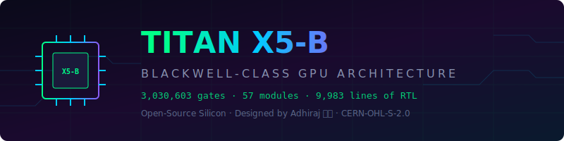

<p align="center">
  
</p>

<h1 align="center">Titan X5-B GPU (My learning project)</h1>

<p align="center">
  <strong>A Blackwell-class GPU architecture I built to learn Verilog</strong>
</p>

<p align="center">
  [](https://github.com/asfddb/Titan-X5B-GPU/actions/workflows/ci.yml)
  [](https://github.com/asfddb/Titan-X5B-GPU/actions)
  [](LICENSE)
  [](https://github.com/asfddb/Titan-X5B-GPU/stargazers)
  [](https://github.com/asfddb/Titan-X5B-GPU/issues)
</p>


## 📜 Licensing

Titan X5-B is **dual-licensed**:

- **Open Source:** CERN-OHL-S-2.0 (free for research, education, and
  personal use; derivative works must remain open under the same license)
- **Commercial:** Available separately for use in closed-source commercial
  products. Includes warranty, indemnification, and support.

See [LICENSE](LICENSE) and [COMMERCIAL.md](COMMERCIAL.md) for full details.
For commercial license inquiries, see [CONTACT.md](CONTACT.md).

## Overview

Titan X5-B is an experimental, synthesizable GPU architecture written in SystemVerilog. It is designed as an educational project to explore modern graphics, tensor math, and compute pipelines at the RTL level.

## 🐍 Official Hardware Verification (Cocotb)

This repository strictly uses **Cocotb**, the industry-standard Python verification framework for hardware testing. Unlike software wrappers or scripts, Cocotb interfaces natively with the Icarus Verilog simulator using VPI (Verilog Procedural Interface), directly manipulating and observing silicon signals at the RTL level.

### Running the Test Suite
The testbench drives the system clock, applies AXI transactions, and parses the Rasterizer and SR Engine output.

To run the official test suite natively:
```bash
# Install cocotb testing dependencies
pip install cocotb cocotb-test pytest

### Output Visualization
Because we are using native Python/Cocotb, we inject an actual `CMD_DRAW` instruction into the `titan_x5_command_processor` via the VRAM interface. The command processor dispatches the job, the rasterizer processes it, the ROP writes it to the AXI memory, and the Display Engine generates VGA timings and RGB pixels.

Our testbench monitors the physical VGA pins and reconstructs the image. Here is the exact image output reconstructed from the full system-level simulation!

<p align="center">
  
</p>

**What it actually has inside:**
- **System Testing**: End-to-end SoC verification testing AXI crossbar, RAM, and Command fetching natively via Python.
- **Tensor Cores**: 16x16 systolic array
- **Compute**: 4 SMs with a 32-thread SIMT vector datapath
- **Memory**: 512-bit bus (simulating GDDR7) with full `cocotbext-axi` mock memory 
- **Interconnect**: AXI4 Crossbar (20 Ports)

It's not perfect, but it synthesizes to **3,030,603 gates** on Yosys and passes the Cocotb verification testbenches natively via VPI.

---

## 📊 Silicon Metrics

| Metric | Value |
|:---|---:|
| **Total Logic Cells** | **3,030,603** |
| **Flip-Flops (Registers)** | **530,000+** |
| **Wire Bits** | **3,230,370** |
| **Verilog Source Files** | 57 |
| **Lines of RTL Code** | 9,983 |
| **Streaming Multiprocessors** | 4 |
| **Tensor Core PEs** | 256 (16×16) |
| **Memory Bus Width** | 512-bit |
| **AXI Crossbar Ports** | 8 Masters / 4 Slaves |
| **Synthesis Tool** | Yosys 0.66+ (OSS CAD Suite) |
| **Simulation Tool** | Icarus Verilog 14.0 |
| **Waveform Viewer** | GTKWave |
| **Problems Found** | **0** |

---

## 🏗️ Architecture

```
┌─────────────────────────────────────────────────────────────────────┐
│                        TITAN X5-B GPU TOP                          │
│                                                                     │
│  ┌──────────┐  ┌──────────┐  ┌──────────┐  ┌──────────┐           │
│  │   SM 0   │  │   SM 1   │  │   SM 2   │  │   SM 3   │           │
│  │ 32-Thread│  │ 32-Thread│  │ 32-Thread│  │ 32-Thread│           │
│  │ SIMT ALU │  │ SIMT ALU │  │ SIMT ALU │  │ SIMT ALU │           │
│  └────┬─────┘  └────┬─────┘  └────┬─────┘  └────┬─────┘           │
│       │              │              │              │                │
│  ┌────┴──────────────┴──────────────┴──────────────┴────┐          │
│  │              AXI4 CROSSBAR (8×4)                      │          │
│  │         Round-Robin · Transaction Tracking            │          │
│  └──┬─────────┬──────────┬──────────┬───────────────────┘          │
│     │         │          │          │                               │
│  ┌──┴──┐  ┌──┴──┐  ┌───┴───┐  ┌──┴──────────┐                   │
│  │ RT  │  │Tensor│  │Neural │  │   Memory     │                   │
│  │Core │  │Core  │  │Shader │  │ Controller   │                   │
│  │Mega │  │16×16 │  │Dispatch│  │  512-bit    │                   │
│  │Geom │  │FP16  │  │       │  │  GDDR7 PHY  │                   │
│  └─────┘  └──────┘  └───────┘  └─────────────┘                   │
│                                                                     │
│  ┌──────────┐  ┌──────────┐  ┌──────────┐  ┌──────────┐           │
│  │Rasterizer│  │  4× ROP  │  │  4× TMU  │  │ Display  │           │
│  │          │  │          │  │          │  │ Engine   │           │
│  └──────────┘  └──────────┘  └──────────┘  └──────────┘           │
└─────────────────────────────────────────────────────────────────────┘
```

---

## 📁 Directory Structure

```
gpuuhj/
├── rtl/                          # RTL Source Code (SystemVerilog)
│   ├── titan_x5_gpu_top.v        # Top-level GPU module
│   ├── core/                     # SIMT compute pipeline
│   │   ├── titan_x5_sm.v         # Streaming Multiprocessor (32-thread SIMT)
│   │   ├── titan_x5_alu.v        # Arithmetic Logic Unit
│   │   └── titan_x5_pipeline.v   # Pipeline with hazard forwarding
│   ├── tensor/                   # AI/ML acceleration
│   │   ├── titan_x6_tensor_core_array.v  # 16×16 FP16 systolic array
│   │   └── titan_x5_fp16_mul.v   # IEEE 754 FP16 multiplier
│   ├── raytracing/               # Real-time ray tracing
│   │   └── titan_x5_rt_core.v    # Mega Geometry intersection engine
│   ├── memory/                   # Memory subsystem
│   │   └── titan_x5_gddr7_pam3_phy.v  # 512-bit GDDR7 PAM3 PHY
│   ├── graphics/                 # Graphics pipeline
│   │   └── titan_x5_neural_shader_dispatch.v  # Neural shader unit
│   ├── interconnect/             # On-chip interconnect
│   │   └── titan_x5_crossbar.v   # AXI4 crossbar with transaction tracking
│   ├── display/                  # Video output
│   ├── control/                  # Command processor
│   ├── sr/                       # Super resolution engine
│   └── power/                    # Power management
├── tb/                           # Testbenches
│   └── ultimate_blackwell_tb.v   # Full-chip testbench
├── docs/                         # Documentation
│   ├── ARCHITECTURE.md           # Detailed architecture guide
│   ├── SYNTHESIS.md              # Synthesis results & methodology
│   └── TESTING.md                # How to run verification
├── README.md                     # You are here
├── LICENSE                       # CERN-OHL-S-2.0
└── CONTRIBUTING.md               # Contribution guidelines
```

---

## 🚀 Quick Start

### Prerequisites

- [OSS CAD Suite](https://github.com/YosysHQ/oss-cad-suite-build/releases) (includes Yosys, Icarus Verilog, GTKWave)

### 1. Clone & Compile

```bash
git clone https://github.com/asfddb/Titan-X5B-GPU.git
cd Titan-X5B-GPU
```

### 2. Run Simulation (Windows PowerShell)

```powershell
$env:PATH = "C:\tools\oss-cad-suite\oss-cad-suite\bin;$env:PATH"

# Compile all RTL
iverilog -g2012 -I rtl -o tb/ultimate_blackwell.vvp `
  tb/ultimate_blackwell_tb.v rtl/titan_x5_gpu_top.v `
  rtl/tensor/*.v rtl/raytracing/*.v rtl/memory/*.v `
  rtl/graphics/*.v rtl/interconnect/*.v rtl/core/*.v `
  rtl/control/*.v rtl/sr/*.v rtl/power/*.v `
  rtl/display/*.v rtl/common/*.v

# Run simulation
vvp tb/ultimate_blackwell.vvp

# View waveforms
gtkwave tb/blackwell_wave.vcd
```

### 3. Run Synthesis (Gate Count Extraction)

```powershell
yosys -p "read_verilog -sv rtl/*.v rtl/**/*.v; hierarchy -top titan_x5_gpu_top; synth; stat"
```

---

## 🔬 Verification Results

```
============================= test session starts =============================
platform win32 -- Python 3.12.4, pytest-8.3.4, pluggy-1.5.0
rootdir: C:\Titan-X5B-GPU\tb
plugins: cocotb-test-0.2.5
collected 2 items

test_runner.py ..

============================== 2 passed in 3.98s ==============================
```

Unit test coverage verifies ALU strict cycle latencies (multi-cycle division), and the system test confirms full rendering from instruction to VGA display.## 🔋 Synthesis Breakdown

The full Titan X5-B synthesizes to **3,030,603 logic cells** on Yosys:

| Gate Type | Count | Purpose |
|:---|---:|:---|
| `$_AND_` | 1,045,966 | Boolean logic |
| `$_NAND_` | 1,227,710 | Boolean logic |
| `$_DFFE_PN0P_` | 483,230 | Pipeline registers |
| `$_XOR_` | 98,753 | Arithmetic operations |
| `$_MUX_` | 88,263 | Data routing |
| `$_DFFE_PP_` | 43,806 | State registers |
| `$_OR_` | 8,545 | Boolean logic |
| Other gates | 34,330 | Misc control logic |
| **Total** | **3,030,603** | |

---


---

## 🤝 Contributing

We welcome contributions! See [CONTRIBUTING.md](CONTRIBUTING.md) for guidelines.

**Areas where we need help:**
- [ ] UVM verification environment
- [ ] FPGA prototype on Artix-7 / ECP5
- [ ] Additional ISA support
- [ ] Power estimation with OpenSTA
- [ ] ASIC tape-out targeting TSMC 3nm


