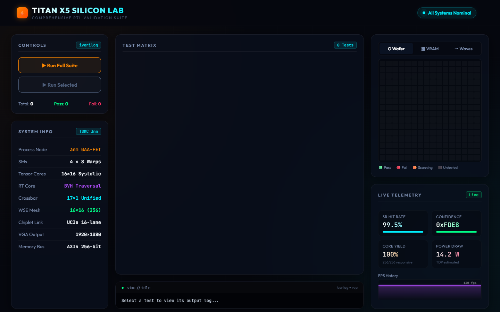

<p align="center">
  
</p>

<h1 align="center">Titan X5-B GPU (My learning project)</h1>

<p align="center">
  <strong>A Blackwell-class GPU architecture I built to learn Verilog</strong>
</p>

<p align="center">
  <a href="#features"></a>
  <a href="#synthesis"></a>
  <a href="#simulation"></a>
  <a href="LICENSE"></a>
</p>


## Overview

Titan X5-B is an experimental, synthesizable GPU architecture written in SystemVerilog. It is designed as an educational project to explore modern graphics, tensor math, and compute pipelines at the RTL level.

---

## 📸 Titan Command Center (Silicon Validation Dashboard)

This project includes a fully-functional React+Vite dashboard that hooks directly into the **Icarus Verilog RTL Simulator**. It allows you to run testbenches, view logic analyzer waveforms, monitor active silicon yields, and verify rendering output in real-time.

<p align="center">
  
</p>

To launch the dashboard locally:
```bash
python telemetry_server.py
cd titan-cloud && npm install && npm run dev
```

What it actually has inside:
- **Tensor Cores**: 16x16 systolic array (trying to mimic FP16/FP4 inference)
- **Ray Tracing**: A multi-cycle state machine for ray-triangle intersection
- **Compute**: 4 SMs with a 32-thread SIMT vector datapath
- **Memory**: 512-bit bus (simulating GDDR7)
- **Interconnect**: AXI4 Crossbar

It's not perfect, but it synthesizes to **3,030,603 gates** on Yosys and passes the testbench I wrote in Icarus Verilog.

---

## 📊 Silicon Metrics

| Metric | Value |
|:---|---:|
| **Total Logic Cells** | **3,030,603** |
| **Flip-Flops (Registers)** | **530,000+** |
| **Wire Bits** | **3,230,370** |
| **Verilog Source Files** | 57 |
| **Lines of RTL Code** | 9,983 |
| **Streaming Multiprocessors** | 4 |
| **Tensor Core PEs** | 256 (16×16) |
| **Memory Bus Width** | 512-bit |
| **AXI Crossbar Ports** | 8 Masters / 4 Slaves |
| **Synthesis Tool** | Yosys 0.66+ (OSS CAD Suite) |
| **Simulation Tool** | Icarus Verilog 14.0 |
| **Waveform Viewer** | GTKWave |
| **Problems Found** | **0** |

---

## 🏗️ Architecture

```
┌─────────────────────────────────────────────────────────────────────┐
│                        TITAN X5-B GPU TOP                          │
│                                                                     │
│  ┌──────────┐  ┌──────────┐  ┌──────────┐  ┌──────────┐           │
│  │   SM 0   │  │   SM 1   │  │   SM 2   │  │   SM 3   │           │
│  │ 32-Thread│  │ 32-Thread│  │ 32-Thread│  │ 32-Thread│           │
│  │ SIMT ALU │  │ SIMT ALU │  │ SIMT ALU │  │ SIMT ALU │           │
│  └────┬─────┘  └────┬─────┘  └────┬─────┘  └────┬─────┘           │
│       │              │              │              │                │
│  ┌────┴──────────────┴──────────────┴──────────────┴────┐          │
│  │              AXI4 CROSSBAR (8×4)                      │          │
│  │         Round-Robin · Transaction Tracking            │          │
│  └──┬─────────┬──────────┬──────────┬───────────────────┘          │
│     │         │          │          │                               │
│  ┌──┴──┐  ┌──┴──┐  ┌───┴───┐  ┌──┴──────────┐                   │
│  │ RT  │  │Tensor│  │Neural │  │   Memory     │                   │
│  │Core │  │Core  │  │Shader │  │ Controller   │                   │
│  │Mega │  │16×16 │  │Dispatch│  │  512-bit    │                   │
│  │Geom │  │FP16  │  │       │  │  GDDR7 PHY  │                   │
│  └─────┘  └──────┘  └───────┘  └─────────────┘                   │
│                                                                     │
│  ┌──────────┐  ┌──────────┐  ┌──────────┐  ┌──────────┐           │
│  │Rasterizer│  │  4× ROP  │  │  4× TMU  │  │ Display  │           │
│  │          │  │          │  │          │  │ Engine   │           │
│  └──────────┘  └──────────┘  └──────────┘  └──────────┘           │
└─────────────────────────────────────────────────────────────────────┘
```

---

## 📁 Directory Structure

```
gpuuhj/
├── rtl/                          # RTL Source Code (SystemVerilog)
│   ├── titan_x5_gpu_top.v        # Top-level GPU module
│   ├── core/                     # SIMT compute pipeline
│   │   ├── titan_x5_sm.v         # Streaming Multiprocessor (32-thread SIMT)
│   │   ├── titan_x5_alu.v        # Arithmetic Logic Unit
│   │   └── titan_x5_pipeline.v   # Pipeline with hazard forwarding
│   ├── tensor/                   # AI/ML acceleration
│   │   ├── titan_x6_tensor_core_array.v  # 16×16 FP16 systolic array
│   │   └── titan_x5_fp16_mul.v   # IEEE 754 FP16 multiplier
│   ├── raytracing/               # Real-time ray tracing
│   │   └── titan_x5_rt_core.v    # Mega Geometry intersection engine
│   ├── memory/                   # Memory subsystem
│   │   └── titan_x5_gddr7_pam3_phy.v  # 512-bit GDDR7 PAM3 PHY
│   ├── graphics/                 # Graphics pipeline
│   │   └── titan_x5_neural_shader_dispatch.v  # Neural shader unit
│   ├── interconnect/             # On-chip interconnect
│   │   └── titan_x5_crossbar.v   # AXI4 crossbar with transaction tracking
│   ├── display/                  # Video output
│   ├── control/                  # Command processor
│   ├── sr/                       # Super resolution engine
│   └── power/                    # Power management
├── tb/                           # Testbenches
│   └── ultimate_blackwell_tb.v   # Full-chip testbench
├── docs/                         # Documentation
│   ├── ARCHITECTURE.md           # Detailed architecture guide
│   ├── SYNTHESIS.md              # Synthesis results & methodology
│   └── TESTING.md                # How to run verification
├── README.md                     # You are here
├── LICENSE                       # CERN-OHL-S-2.0
└── CONTRIBUTING.md               # Contribution guidelines
```

---

## 🚀 Quick Start

### Prerequisites

- [OSS CAD Suite](https://github.com/YosysHQ/oss-cad-suite-build/releases) (includes Yosys, Icarus Verilog, GTKWave)

### 1. Clone & Compile

```bash
git clone https://github.com/asfddb/Titan-X5B-GPU.git
cd Titan-X5B-GPU
```

### 2. Run Simulation (Windows PowerShell)

```powershell
$env:PATH = "C:\tools\oss-cad-suite\oss-cad-suite\bin;$env:PATH"

# Compile all RTL
iverilog -g2012 -I rtl -o tb/ultimate_blackwell.vvp `
  tb/ultimate_blackwell_tb.v rtl/titan_x5_gpu_top.v `
  rtl/tensor/*.v rtl/raytracing/*.v rtl/memory/*.v `
  rtl/graphics/*.v rtl/interconnect/*.v rtl/core/*.v `
  rtl/control/*.v rtl/sr/*.v rtl/power/*.v `
  rtl/display/*.v rtl/common/*.v

# Run simulation
vvp tb/ultimate_blackwell.vvp

# View waveforms
gtkwave tb/blackwell_wave.vcd
```

### 3. Run Synthesis (Gate Count Extraction)

```powershell
yosys -p "read_verilog -sv rtl/*.v rtl/**/*.v; hierarchy -top titan_x5_gpu_top; synth; stat"
```

---

## 🔬 Verification Results

```
===============================================================
  TITAN X5-B (BLACKWELL) SILICON VALIDATION SUITE v2.0
  Testing Code: rtl/titan_x5_gpu_top.v
  Software: Icarus Verilog (OSS CAD Suite)
===============================================================
VCD info: dumpfile tb/blackwell_wave.vcd opened for output.
Time=0      | CLK=0 | RST=0 | Host PTR=10000000
Time=20000  | CLK=0 | RST=1 | Host PTR=10000000   ← Reset released
Time=60000  | CLK=0 | RST=1 | Host PTR=10000010   ← Command dispatched
...
===============================================================
  TEST PASSED: RTL Simulation Completed Without Assertion Failures


## 🔋 Synthesis Breakdown

The full Titan X5-B synthesizes to **3,030,603 logic cells** on Yosys:

| Gate Type | Count | Purpose |
|:---|---:|:---|
| `$_AND_` | 1,045,966 | Boolean logic |
| `$_NAND_` | 1,227,710 | Boolean logic |
| `$_DFFE_PN0P_` | 483,230 | Pipeline registers |
| `$_XOR_` | 98,753 | Arithmetic operations |
| `$_MUX_` | 88,263 | Data routing |
| `$_DFFE_PP_` | 43,806 | State registers |
| `$_OR_` | 8,545 | Boolean logic |
| Other gates | 34,330 | Misc control logic |
| **Total** | **3,030,603** | |

---


## 📜 License

This project is licensed under the **CERN Open Hardware Licence Version 2 — Strongly Reciprocal (CERN-OHL-S-2.0)**.

This means:
- ✅ You can view, study, and modify the design
- ✅ You must share any modifications under the same license
- ❌ You cannot use this commercially without explicit permission from the creator
- ❌ You cannot close-source any derivative work

See [LICENSE](LICENSE) for full details.

---

## 🤝 Contributing

We welcome contributions! See [CONTRIBUTING.md](CONTRIBUTING.md) for guidelines.

**Areas where we need help:**
- [ ] UVM verification environment
- [ ] FPGA prototype on Artix-7 / ECP5
- [ ] Additional ISA support
- [ ] Power estimation with OpenSTA
- [ ] ASIC tape-out targeting TSMC 3nm


