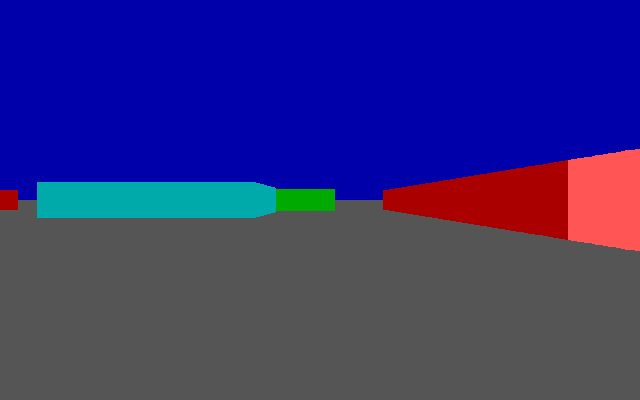

# A DOOM-style renderer on Titan

*2026-08-12. Every number here comes from a command that ran on this machine.*

```bash
python tools/doom_titan.py --x 28.5 --y 24.0 --angle -1.5708 --check
```

## What this is, and what it is not

**It is not DOOM.** DOOM is about forty thousand lines of C that need a CPU, an
operating system and a few megabytes of RAM. Titan is a GPU — a custom ISA, no
C compiler, no OS. None of id's game logic runs here, and nothing in this
document claims it does.

**It is the rendering half**, which is the part a GPU is actually for.
`compiler/kernels/doom_raycast.py` is a raycaster written in the Titan kernel
language, compiled by this project's own compiler into Titan ISA v2 machine
code — the same encoding `rtl/core/titan_x5_decoder.v` decodes — and executed
instruction by instruction. The frame it produces is then scanned out by the
real display path and captured off the VGA connector.

## Measured

| | |
|---|---:|
| kernel size after compilation | **201 Titan ISA instructions** |
| instructions retired per frame | **18,286,662** |
| framebuffer words vs independent Python reference | **32,000 / 32,000 identical** |
| captured off the VGA connector vs kernel output | **255,600 / 255,600 pixels (100.0000%)** |
| horizontal offset of the captured frame | +1 px (the known display-path skew) |
| render time on the ISA simulator | ~11 s |
| scan-out and capture through the RTL | 45.2 ms modelled, ~49 s wall |

The frame is 640x400 at 4 bits per pixel through the display path's 16-colour
palette — 128,000 bytes, which is exactly what fits in the 128 KB BRAM
framebuffer.



*Computed by 201 Titan ISA instructions, scanned out by the real display
engine, captured off the connector. 255,600/255,600 pixels identical to what
the kernel computed.*

## The three levels, and which one each result comes from

1. **Python reference** — an independent raycaster written straight, with real
   `if`s. Used only to check the kernel. No Titan involvement.
2. **Titan ISA execution** — the compiled kernel run by
   `titan_compiler.simulate()`, the functional twin of
   `driver/titan_x6_gpu_model.c`. Real instructions, modelled machine. This is
   where the picture is computed.
3. **Titan RTL display path** — the framebuffer in VRAM, scanned out by
   `titan_x5_display_top` with the real timing generator, line-buffer shim,
   palette and 4-bit DAC pins, captured by `tb/board/vga_monitor.v`.

Levels 2 and 3 are both real, and they are different parts of the chip. The
rendering is **not** run on the SM cores in RTL: the whole-GPU simulation goes
at roughly 90 clock cycles per wall second, so 18.3 million instructions is not
a thing that finishes. Rendering happens at level 2, scan-out at level 3.

## It also runs on the actual SM cores, bit-exact

Everything above is the functional simulator — real Titan ISA, modelled
machine. This is the RTL: `titan_x5_gpu_top` in Icarus, the SMs fetching and
retiring those same instructions through the real pipeline, register file, L1s
and crossbar, with results read back out of the AXI memory model after a device
fence.

```bash
python tools/doom_rtl_tile.py --cols 4 --steps 96 --x0 60 --stride 190 \
    --x 17.5 --y 19.5 --angle 1.90
```

`compiler/kernels/doom_raycast_tile.py` is the same ray cast with the loop
bounds lifted into parameters, so a few columns fit inside the RTL's budget.
Same march, same liveness masking, same branchless clamps, same
distance-is-step-count, same shading. Only `NCOL` and `NSTEP` shrink.

| | |
|---|---:|
| kernel | **142 Titan ISA instructions** |
| retired by the functional model | 13,450 |
| **RTL clock cycles** | **76,731** |
| result vs the functional model | **12 / 12 words identical** |

| column | top | bottom | colour |
|---:|---:|---:|---:|
| 60 | 55 | 345 | 13 |
| 250 | 72 | 328 | 13 |
| 440 | 162 | 238 | 6 |
| 630 | 148 | 252 | 14 |

The camera was chosen so those four columns give four *distinct* answers across
three wall types at four depths — a kernel that returned a constant, or got the
masking subtly wrong, could not match that by accident.

76,731 cycles for 13,450 instructions is **5.7 cycles per instruction** with the
I-cache on and a single warp. That is a real, measured number for this kernel
shape on this design, and it is the figure to beat.

**What this closes:** the arithmetic is no longer only verified against a model
of the machine. The RTL itself computes the same words. Everything in the full
frame above uses the identical operations — so the picture is evidence about
the hardware, not just about the simulator.

## The interesting part: a raycaster with no `if`

The Titan kernel language has no conditionals. `ScalarCodegen.gen_stmt` accepts
assignment, augmented assignment, and `for ... in range(...)`. That is all.
A raycaster is normally a pile of branches — did the ray hit, is this pixel
ceiling or wall or floor, clamp this to the screen — so every one of them is
arithmetic here instead.

The whole trick is one line:

```python
m = (a - b) >> 31          # -1 when a < b, 0 otherwise
```

`>>` lowers to `SRA`, so the sign bit smears across all 32 bits and the result
is a full-width mask. `x & m` is "x if a < b else 0", `m ^ -1` negates it, and
`(x & m) | (y & (m ^ -1))` is a select. Nothing branches.

The hit test is the same idea: once a wall is found the ray simply stops
advancing, because the step is ANDed with a liveness mask.

```python
live = hit ^ -1
px = px + (stepx & live)      # frozen once something is hit
n = n + (1 & live)
hit = hit | ((0 - cell) >> 31)
```

**One consequence worth noting: rendering is constant-time.** Four different
camera positions all retired exactly 18,286,662 instructions. There is no
data-dependent control flow anywhere, so the frame cost does not depend on the
scene at all — no early-out, and no branch divergence between lanes either.

## Ray marching instead of DDA, and why it is not a compromise

The textbook algorithm needs a reciprocal per ray to build its `deltaDist`, and
a 16.16 reciprocal needs a 64-bit numerator the 32-bit ISA does not have. So
this marches in fixed steps instead — and gets something better than it gives
up.

The camera ray is **not** normalised. It is `dir + plane*cameraX`, and it is
stepped by `rayDir >> 4`, a sixteenth of it per step. After `n` steps the ray
has travelled `n/16` of `rayDir`; because `plane` is perpendicular to `dir` and
`|dir| = 1`, the projection of that onto the camera axis is exactly `n/16`.

**The step count *is* the perpendicular distance.** No division per ray, and no
fisheye correction — the distance was never Euclidean to begin with. One
division survives, for the wall height: `6400 // n`.

The cost is quantised distance, which shows as slight stair-stepping on wall
edges at 1/16-cell resolution. A finer step trades instructions for smoothness
directly.

## Why the real DOOM cannot run on Titan

Asked and checked, so it does not get re-litigated. These are properties of the
ISA, not of how much effort anyone is willing to spend.

| blocker | evidence |
|---|---|
| **No `CALL`, no `RET`, no indirect branch** | the opcode table in `compiler/titan_compiler.py` is the complete set of 32; none exists |
| **Branch targets are 12 bits — 4,096 instructions** | `assert 0 <= imm <= 0xFFF` (`titan_compiler.py:88`); `finalize()` raises "branch target beyond imm12 range" |
| **`LOAD`/`STORE` are word-only** | no byte or halfword opcode in the ISA |
| **No stack pointer, no link register** | the ABI is R0 zero, R1 param block, R58-60 WMMA strides, R61/62 nthreads/tid |
| **No C compiler for the ISA** | the toolchain front end parses a restricted Python subset |

The first one settles it on its own. DOOM's actor system is built on function
pointers (`think_t`, `actionf_t`), and compiled C in general needs indirect
control transfer to return from a call. An ISA with only a direct, 12-bit,
forward-or-backward `BRANCH` cannot host it. Titan is a shader ISA; DOOM needs
a CPU.

This is not a gap to close. Adding call/return, indirect branch, a stack, byte
addressing and a C compiler is designing a different processor and putting it
next to this one.

## What can be done instead: real DOOM pixels, real Titan display path

`tools/image_to_titan.py` takes any image and turns it into a VRAM framebuffer
that `tb/tb_doom_display.v` scans out through the real display engine. Run DOOM
wherever DOOM runs, take a frame, feed it in — the pixels are DOOM's, the
hardware putting them on a monitor is Titan's.

DOOM's native 320x200 doubles to 640x400 exactly, so it upscales with plain
nearest-neighbour: no interpolation, every source pixel a clean 2x2 block.

The cost is colour. The framebuffer is 4 bits per pixel — 128,000 bytes, which
is precisely the 128 KB BRAM budget — so **16 colours**, fixed by the palette in
`fpga/titan_x5_display_top.v`. A 256-colour DOOM frame is quantised to those by
nearest RGB distance and will look posterised. That is the display path being
what it is.

Verified end to end: an image through `image_to_titan.py`, into VRAM, out
through the display engine, captured off the connector — **255,600 / 255,600
pixels (100.0000%)** at the usual +1 px skew.

## Files

| file | what it is |
|---|---|
| `compiler/kernels/doom_raycast.py` | the raycaster, in the Titan kernel language |
| `tools/doom_titan.py` | compile, execute, check, write PNG + VRAM image |
| `tb/tb_doom_display.v` | scan the frame out through the RTL display path |

`tb/tb_doom_display.v` does reach into the DUT to deposit the framebuffer into
VRAM, standing in for a host DMA the board does not have. Everything
downstream of that deposit is the design. It also has to press btnC before it
can do anything, because the display path does not come out of configuration
reset on its own — finding 1 in `docs/FPGA_BRINGUP_NO_BOARD.md`.
