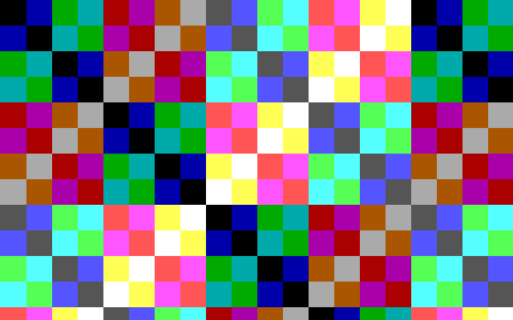

# FPGA bring-up without an FPGA board

*2026-08-12. Every number here comes from a command that ran on this machine.
Where a measurement was not possible, it says so instead of estimating.*

`docs/FPGA_PHASE1_REPORT.md` §6 identified the display path as the one part of
this GPU that fits an xc7a35t, and named it the route to "Hardware Hello
World". That has been parked on owning a Basys 3 and on Vivado for a bitstream.

Most of what standing at the bench would tell you does not need the bench:

| what you would do at the board | what replaces it here |
|---|---|
| apply power, press nothing, see if it runs | `basys3_board` free-running crystal + configuration model |
| plug in a monitor | `vga_monitor`, which sees only R, G, B, HSYNC, VSYNC |
| check the picture is right | frame captured to PPM, checked against the pattern |
| poke buttons and switches, read the LEDs | mechanical button model with contact bounce |
| confirm the *bitstream* behaves like the source | post-synthesis netlist through the same harness |
| check it meets timing | **not available — see "What is still unmeasured"** |

Run it all with:

```bash
python tools/run_fpga_bringup.py
```

---

## 1. The rule this rig keeps

`tb/tb_board_bringup.v` contains **no hierarchical reference into the design**.
No `dut.u_disp.h_counter`, no `dut.clk_pixel`, no `vga_de`. None of those exist
on a board.

This is not pedantry, and it is what made the rig worth building. A testbench
that reads the DUT's own pixel counters is asking the design where the pixels
are, and will agree with itself even when the sync pulses, the porches or the
output pipeline are wrong. `tb/tb_display_top.v` does exactly that — correctly,
because it is a unit test. It also passes on a design that produces no video at
all on cold power-up, which is the first thing this rig found.

A VGA cable carries five signals and no pixel clock, so `vga_monitor` has none.
It measures the sync pulses, decides polarity from whichever level is the
minority, divides the measured line period by the mode's horizontal total to
recover a pixel clock, and counts porches from the sync edge to find the
visible window — the same sequence a monitor's PLL runs. If the back porch is
wrong the captured image shifts, exactly as it would on a desk.

## 2. What the board model provides

`tb/board/basys3_board.v`:

- 100 MHz crystal, free-running from power-on
- an FPGA configuration interval, after which the fabric starts. This stands
  in for GSR releasing every flop at its bitstream INIT value; it models the
  effect, not the mechanism, because plain RTL has no GSR to drive. It buys
  one thing that matters: "came up on its own after configuration" becomes an
  event that happens during the run rather than something already true at t=0.
- buttons as mechanical contacts that **bounce**, ~0.8 ms of chatter driven by
  a fixed LFSR so every run is byte-identical and RTL and gate runs see the
  same edges. Basys 3 buttons are undebounced in hardware; the FPGA really
  does see every one of these edges.
- slide switches, already in position when power is applied

**Nothing presses reset before the first frame.** That is the point of step 1.

---

## 3. Measured: synthesis to Artix-7

`fpga/synth_display_basys3.ys`, yosys 0.67, `synth_xilinx -family xc7`:

| resource | display path | xc7a35t | used |
|---|---:|---:|---:|
| LUT | 1,605 | 20,800 | 7.7% |
| FF | 2,883 | 41,600 | 6.9% |
| RAMB36 | 32 | 50 | 64.0% |
| DSP48 | 1 | 90 | 1.1% |

Also 85 CARRY4, 296 MUXF7, 13 MUXF8, 3 BUFG, 19 IBUF, 30 OBUF. Yosys puts the
design at 1,343 estimated logic cells.

It fits, with the block RAM the tightest resource at 64% — expected, since the
128 KB framebuffer is the whole point of the subset. This is the first
whole-design fit number for any Titan configuration; `FPGA_PHASE1_REPORT.md`
could only report per-block figures because the full GPU OOM-killed yosys.

## 4. Measured: at the VGA connector

From `tb/board/vga_monitor.v`, RTL build, after the reset press:

| measured at the connector | value | 640x400@70 standard | |
|---|---:|---:|:--|
| lines per frame | 449 | 449 | ok |
| line period | 32.000 us | 32.000 us | ok |
| line rate | 31.250 kHz | 31.469 kHz nominal | ok |
| hsync pulse | 3.840 us | 96 px = 3.840 us | ok |
| vsync pulse | 64.000 us | 2 lines = 64.000 us | ok |
| frame period | 14.368 ms | 14.268 ms nominal | ok |
| frame rate | 69.599 Hz | 70.087 Hz nominal | ok |
| recovered pixel clock | 25.0000 MHz | 25.175 MHz nominal | ok |
| hsync polarity | **POSITIVE** | **NEGATIVE** | **see finding 2** |
| vsync polarity | POSITIVE | POSITIVE | ok |

The 0.7% low frame rate is the deliberate 25.000 vs 25.175 MHz pixel clock
choice documented in `titan_x5_display_top.v`, and is inside monitor tolerance.



*What a monitor plugged into the Basys 3 would show, sampled off R/G/B/HSYNC/VSYNC
by `tb/board/vga_monitor.v` -- not read out of the design's own counters.*

Captured frame, `tb/board/check_frame.py`:

- **255,600 / 255,600 pixels match the expected XOR pattern (100.0000%)**
- 0 pixels sampled as X on the DAC pins during the visible window
- picture displaced **+1 pixel** horizontally relative to the sync pulses
- DAC pins at black through sync and both porches, so a monitor's black-level
  clamp lands correctly
- line period stable across 200 consecutive lines

---

## 4b. Measured: the same testbench against the netlist

`python tools/run_fpga_bringup.py` stage 4, `+gate` profile — post-synthesis
Artix-7 netlist, yosys Xilinx primitives, nothing pressed:

| check | RTL | netlist |
|---|:--|:--|
| cold boot, video on the connector | **none** | **present, 31 hsync/ms** |
| lines per frame | 449 | 449 |
| line period | 32.000 us | 32.000 us |
| hsync pulse | 96 px | 96 px |
| vsync pulse | 2 lines | 2 lines |
| frame period | 14.368 ms | 14.368 ms |
| recovered pixel clock | 25.0000 MHz | 25.0000 MHz |
| hsync polarity | POSITIVE (wrong) | POSITIVE (wrong) |
| DAC black through blanking | pass | pass |
| line jitter | 0.000 ns | 0.000 ns |
| **pixel data** | **100.0000% correct** | **not simulatable — see below** |

Every timing property survives synthesis unchanged, and the hsync polarity
defect survives with it — it is in the design, not an artefact of RTL
simulation. The cold-boot row is the finding in section 5.

### The pixel data cannot be gate-simulated with this toolchain

The netlist capture came back with **all 256,000 visible pixels at X**. That is
not a defect in the design and not a synthesis error. Yosys's
`share/yosys/xilinx/cells_sim.v` defines `RAMB36E1` with **no `always` block,
no `initial` block, and no driver on `DOADO`/`DOBDO`** — only `specify` timing
paths. It is a timing shell for synthesis, not a functional memory model; the
functional one lives in Xilinx's `unisims`, which oss-cad-suite does not ship
because it is vendor-licensed.

So every pixel read comes back undriven, and the framebuffer path is dark. The
split is clean and worth stating exactly:

- **Gate-simulatable, and verified:** sync generation, all mode timing, sync
  polarity, blanking, line stability, cold-boot behaviour — everything in LUTs
  and flops. This is where the reset finding lives.
- **Not gate-simulatable here:** anything whose data passes through block RAM,
  which is the picture itself.

Two ways to close it, neither taken: install Vivado and simulate against
`unisims`, or write a behavioural `RAMB36E1`. The second is tempting and was
rejected — a hand-written memory model validated against the same RTL it is
meant to check is circular, and a subtly wrong one would produce exactly the
kind of confident, wrong picture that finding 5 is about.

## 5. Findings

### Finding 1 — cold power-on produces no video, and the old test could not see it

Power applied, nothing pressed: **0 hsync edges in 5 ms** (156 line periods).
The core domain is fine — VRAM fills and `led[0]` lights at 101 us — but the
VGA connector stays dead.

The cause is exact. `titan_x5_display_top` builds `rst_n` from a two-stage
synchroniser clocked by `clk_core` at 100 MHz, and hands that same `rst_n` to
the display engine, whose counters are clocked by the 25 MHz `pclk`. Out of
configuration, `rst_n` releases two `clk_core` edges after the clock starts —
which is the same instant `pclk_div` first reaches 2 and produces its first
rising edge. Measured, with a counter on pclk edges taken while `rst_n` is low:

| | pclk edges seen while `rst_n` low | `h_counter` after |
|---|---:|:--|
| cold boot, nothing pressed | **0** | **x** |
| after a btnC press | 70,400 | 0 |

Not one pixel-clock edge ever lands inside the reset window, so the display
engine's `if (!rst_n)` branch never executes and `h_counter` stays X forever.

`tb/tb_display_top.v` starts with `reg btnC = 1;` — it holds reset for you.
That single line is the whole reason this has never been seen. **This is the
fifth time in this project that a defect survived because the harness was
helping**, after the four the handoff already names.

**The netlist run settles what the board would actually do.** The same
testbench, same board model, nothing pressed, run against the post-synthesis
Artix-7 netlist where every flop carries the INIT value configuration loads:

```
t=1 ms  led=0001  hsync_edges=31  vsync_edges=0
t=2 ms  led=0001  hsync_edges=62  vsync_edges=0
t=3 ms  led=0001  hsync_edges=93  vsync_edges=0
COLD BOOT RESULT: VIDEO PRESENT
```

31 hsync edges per millisecond is 31.25 kHz — the correct line rate. **The
netlist cold-boots with video; the RTL does not.** That difference is the whole
finding, and it is only visible because the same harness was pointed at both.

Two separate problems are tangled here, and both are real:

1. **The reset never reaches the pixel domain at power-on.** On the Basys 3
   this is masked, and the netlist run above is the proof: configuration loads
   INIT into every flop, so `h_counter` starts at 0 whether or not reset
   arrives. On the GT2N ASIC target there is no configuration and no INIT —
   flops power up arbitrarily, and this design would come up with garbage
   counters and no video, permanently. **The design is currently relying on
   FPGA power-up state for correctness, and nothing said so.**
2. **`rst_n` is a reset-domain crossing.** It is generated in `clk_core` and
   used as an asynchronous reset in the `pclk` domain with no re-synchronis-
   ation on the release edge. That is a reset-removal hazard on real silicon,
   and it is the same `SYNCASYNCNET` class the handoff already flags as a
   "real reset-domain hazard for FPGA bring-up".

The standard fix addresses both: give the pixel domain its own reset
synchroniser — assert asynchronously from `rst_n`, release synchronously to
`pclk` — and feed the display engine that instead. It needs a second reset port
on `titan_x5_display_engine`, so it touches `titan_x5_gpu_top` too. **Not done
here; this session built the instrument, and changing the reset architecture of
a shared module is a design decision worth making deliberately.**

### Finding 2 — hsync polarity is inverted for this mode

Measured at the connector: hsync **POSITIVE**, vsync POSITIVE.

IBM VGA assigns 640x400@70 **negative** hsync and **positive** vsync. The
polarity pair is not decoration — it is how a monitor distinguishes 640x400
from 640x350 and 720x400, which all share the 31.5 kHz line rate. 640x350 is
+hsync/-vsync, 720x400 is -hsync/+vsync, and +/+ is not any of them.

`titan_x5_display_engine.v:145` drives `vga_hsync <= next_hsync`, where
`next_hsync` is high across the sync window. Both syncs are active-high;
vsync happens to be correct for this mode and hsync does not.

A multisync monitor will usually still lock, but the mode it reports will be
wrong, and a monitor that trusts the polarity pair may refuse the signal
outright. The fix is one inversion at the output, but it is a per-mode property
— the engine takes porch widths as inputs and should take polarity the same
way rather than hardcoding active-high.

### Finding 3 — the picture sits one pixel right of the sync pulses

Measured, not assumed: the checker solves for the offset that best matches, and
gets **+1 pixel** at a 100.0000% pixel match.

`tb/tb_display_top.v` already documents 2 pclk of output latency and
compensates by subtracting 2 from `h_counter`. This is the same effect measured
from the far end of the cable, against the sync pulses, where it comes to +1.
It is a one-pixel horizontal displacement — cosmetic, and now quantified from
the connector rather than inferred from internal counters.

### Finding 4 — the line buffer is not invalidated on a pattern reload

`line_valid` in `titan_x5_display_top.v` is cleared only by reset, never when
btnU triggers a refill. A cached 64-byte line whose tag still matches can serve
up to 128 pixels of the *previous* pattern after a reload.

Latent and transient — by the time a frame is captured the buffer has turned
over many times, so the rig does not catch it and the frames are clean. It
would show as a brief 128-pixel smear on one scanline when the button is
pressed. Noted rather than fixed.

---

### Finding 5 — the instrument had this same class of bug, and it looked fine

Worth recording, because it is the argument for the whole approach.

An early version of `capture_frame` tried to save a frame by joining the frame
already in progress, counting hsync edges since the last vertical sync. It
produced a capture that was **93.5% correct** — a plausible number that could
easily have been written down as "close enough, some edge effect".

It was not an edge effect. The wrong pixels were exactly the rows where
`y mod 32` is 30 or 31 — the last two rows of every band of the test pattern:

```
rows   0- 29: best shift +1,    0 bad pixels/row
rows  30- 31: best shift -4,  586 bad pixels/row
rows  32- 61: best shift +1,    0 bad pixels/row
rows  62- 63: best shift -4,  611 bad pixels/row
...
```

The entire image was displaced two rows. It only *showed* where the pattern
changed, which is one row in sixteen. The cause: vsync polarity cannot be
decided until the pulse ends, so the reference counter reset two lines late —
exactly `V_SYNC`. The fast path was removed; correctness beats a saved frame.

Two things generalise. **A percentage is not a result** — the distribution of
the wrong pixels named the bug in one step, and the aggregate would never have.
And **the measuring instrument gets the same scrutiny as the design**: had this
gone unexamined, every future frame check would have carried a silent two-row
offset and the rig would have been worse than no rig.

## 6. Cost

Measured on this machine, single-threaded Icarus:

| run | modelled time | wall time |
|---|---:|---:|
| RTL, `--quick` | 93.8 ms | ~1.5 min |
| RTL, full (5 frames, all buttons) | 210.8 ms | ~4.9 min |
| netlist, cold-boot probe | 10 ms | ~10 min (killed at 3 ms) |

The netlist simulates roughly **240x slower than the RTL** — 5,318 Artix-7
cells plus 32 behavioural RAMB36E1 models, every one evaluated per edge. A full
netlist frame capture is a background job measured in hours, not a thing to run
on every change. That is why `+gate` exists: it captures the cold-boot picture
and the sync timing and skips the button and pattern tests, which the RTL run
already covers far more cheaply.

Practical division of labour: run the RTL bring-up on every change, and the
netlist run when the design or the synthesis flow moves.

## 7. What is still unmeasured

- **Timing closure.** There is no open-source 7-series place-and-route on this
  machine (`nextpnr` ships no Xilinx target here) and no OpenSTA in the
  oss-cad-suite install. Whether the design closes at 100 MHz on an xc7a35t is
  **unknown and unmeasured**. Only Vivado can answer it, and
  `fpga/vivado_build.tcl` already gates `write_bitstream` on WNS >= 0.
- **A bitstream.** Same reason.
- **Anything analogue** — DAC ladder accuracy, cable loading, real monitor
  behaviour at 69.6 Hz.
- **The full GPU on FPGA.** Unchanged from Phase 1: it misses by roughly two
  orders of magnitude, and that is an area wall, not a timing one.

## 8. Files

| file | what it is |
|---|---|
| `tb/board/basys3_board.v` | crystal, configuration, bouncing buttons, switches |
| `tb/board/vga_monitor.v` | monitor at the connector; measures sync, captures frames |
| `tb/board/check_frame.py` | frame vs expected pattern, frame vs frame, PPM to PNG |
| `tb/tb_board_bringup.v` | the bring-up sequence, pin-level only |
| `fpga/synth_display_basys3.ys` | display path to Artix-7 cells |
| `tools/run_fpga_bringup.py` | runs the whole flow |
