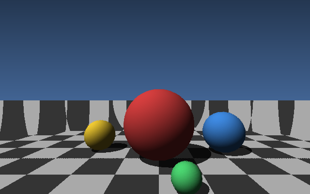
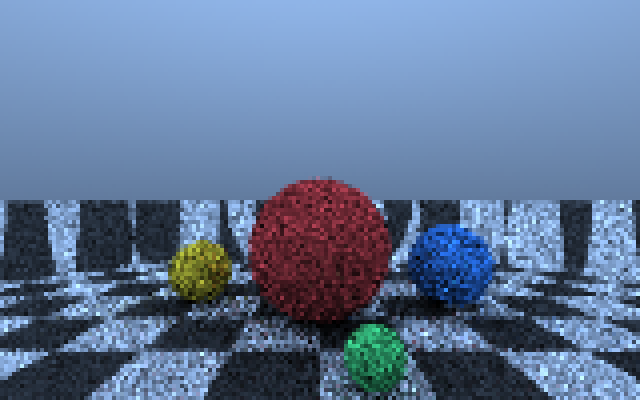

# Ray tracing and path tracing on Titan

*2026-08-12. Every number here comes from a command that ran on this machine.*

```bash
python tools/titan_trace.py raytrace --width 640 --height 400
python tools/titan_trace_parallel.py --width 480 --height 300 --samples 64
```

Both renderers are Titan ISA kernels. `tools/titan_trace.py` emits the kernel
source, `compiler/titan_compiler.py` compiles it to Titan ISA v2 machine code --
the same encoding `rtl/core/titan_x5_decoder.v` decodes -- and
`titan_compiler.simulate()` executes it instruction by instruction.

Note what is *not* used: `rtl/raytracing/titan_x5_rt_core.v` exists and is
instantiated in `titan_x5_gpu_top`, but the ISA has no ray-tracing opcode, so
the compiler cannot reach it. These kernels are pure software tracing on the
integer datapath.

## Measured

| | ray trace | path trace |
|---|---:|---:|
| kernel size | **588 instructions** | **959 instructions** |
| resolution | 640x400 | 160x100 |
| samples / bounces | 1 primary + 1 shadow ray | 10 spp, 3 bounces |
| instructions retired | **685,827,612** | **1,270,352,910** |
| wall time (1 core) | 577 s | 865 s |
| rate | 1.19M instr/s | 1.47M instr/s |



*640x400. Four spheres, hard shadows, checkered plane, sky gradient. Every
sphere edge is a software square root; every conditional is a mask.*



*160x100 at 10 samples/pixel, shown 4x nearest so the pixels are exactly what
the kernel produced. Lit entirely by the sky -- there is no light source in the
scene. The grain is Monte Carlo noise, not an artefact.*

## What the ISA does not give you, and what replaces it

| missing | replacement |
|---|---|
| `if` | `(a - b) >> 31` as a full-width mask; select is `(x & m) \| (y & ~m)` |
| function calls | the kernel source is *emitted*, every helper inlined textually |
| square root | restoring bit-by-bit integer sqrt, 16 branchless iterations, ~200 instructions |
| widening multiply | Q12 fixed point, each dot-product term shifted **before** summing |
| logical right shift | `>>` maps to SRA, so it is spelled `(x >> 17) & 32767` |
| floating point | none used; the reachable ops are integer only |

### Q12, and why the shift placement matters

`MUL` is 32x32 into the low 32 bits. There is no widening multiply reachable
from the kernel language, so a product that overflows int32 is silently wrong.
A dot product is therefore

```python
((ax*bx) >> 12) + ((ay*by) >> 12) + ((az*bz) >> 12)
```

with each term shifted before it is summed. Shifting after the sum would
overflow on three terms. The scene is kept inside +/-6 so each individual
product stays under 2^30.

### The shadow test skips the square root

A square root costs ~200 instructions. A shadow only needs to know *whether*
something blocks the light, not where, so the shadow test checks the sign of
the discriminant and the sign of the projection and stops there. That is the
difference between shadows being affordable and not.

## Path tracing: three things that fixed the image

The first path trace came back nearly black, and the second washed out. Both
were real defects, and both are the kind that produce a plausible picture:

1. **The sky gradient sign was inverted** -- looking *up* got darker.
2. **Uniform hemisphere sampling without the `2 cos(theta)` estimator.**
   Throughput was multiplied by albedo alone, which is only correct for
   cosine-weighted sampling, so every bounce silently lost energy. Now the
   bounce direction is `normalise(n + random_unit_vector)`, which *is*
   cosine-weighted by construction -- lower variance and no correction term.
3. **No gamma.** Linear light written straight into 8 bits looks murky. Output
   now goes through `sqrt` (gamma 2.0), reusing the integer square root the
   intersection code already needed.

A fourth change was quality rather than correctness: the sky gained a **sun
disc** (`dot(ray, lightdir)` raised to the 8th by three squarings, scaled and
added). A uniform sky lights every surface from every direction, which is flat;
a sun gives directional light, real shadows and contrast.

### And one bug worth recording

Adding band rendering introduced a parameter named `y0`, which collided with
the screen-space constant `y0 = fx(1.0)` already in that function. The
generated kernel became `for py in range(4096, 40)` -- an empty loop and a black
image. Renamed to `row0`/`row1`, with a comment at the site.

## Parallel rendering

`titan_compiler.simulate()` is a Python interpreter for the Titan ISA at
roughly two million instructions per second, single-threaded. A path trace at a
sample count high enough not to look grainy costs tens of billions.

The frame splits perfectly: every pixel is independent, and the kernel seeds
its RNG from the pixel index, so a band rendered alone is bit-identical to those
rows rendered as part of the whole. `tools/titan_trace_parallel.py` splits rows
across workers and stitches the result -- verified seamless before use.

This is the lesson `HANDOFF_NEXT_SESSION.md` already records for the compute
suite: the project kept calling simulation speed the binding constraint while
using one core out of sixteen.

## Where this runs, precisely

`titan_compiler.simulate()` -- the functional twin of
`driver/titan_x6_gpu_model.c`. Real Titan ISA, executed instruction by
instruction, on a modelled machine.

**Not the RTL.** The whole-GPU simulation runs at roughly 90 clock cycles per
wall second, and these kernels retire hundreds of millions to billions of
instructions. `docs/DOOM_ON_TITAN.md` shows the raycaster's ray-cast pass
running on the actual SM cores bit-exact, which is the evidence that the
arithmetic these kernels use behaves the same on the hardware description; the
tracers themselves are far too large to run there.

## Files

| file | what it is |
|---|---|
| `tools/titan_trace.py` | emits, compiles and runs both tracers |
| `tools/titan_trace_parallel.py` | splits a frame across cores and stitches |
| `trace_out/*_kernel.py` | the generated kernel source, for reading and diffing |
