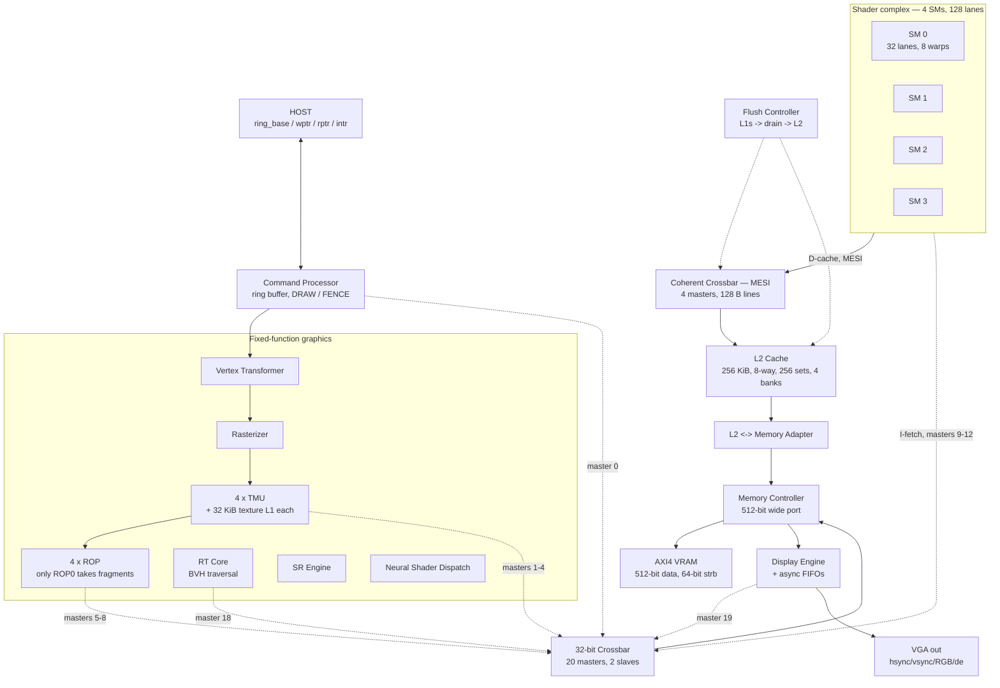

# TITAN APEX-X — chip blueprint

**Top module:** `titan_x5_gpu_top` (`rtl/titan_x5_gpu_top.v`)
**Branch:** `claude/titan-x5-gpu-conversion-lf6udk`
**Drawn:** 2026-08-05

---

## How to read this document

Everything here was **extracted from the RTL**, not written from memory. The
hierarchy, port list, instance counts, cache geometry and interconnect map
were parsed out of the source files; the timing and area figures come from
synthesis runs that were re-executed while writing this. Where a number is
not measured, it says so.

Three caveats travel with every physical figure and are not fine print:

1. **GT2N is a predictive PDK. This is not a fabbable design.** No foundry
   accepts it.
2. **Synthesis only — no floorplan, no placement, no routing.** ABC reports
   `WireLoad = "none"`, i.e. **zero wire delay**. At 2 nm wire delay
   dominates, so place-and-route can only make timing worse.
3. **One process corner** (`tt`, 0.7 V, 25 °C). No slow corner, so no signoff
   margin.

This is a **blueprint of what exists**, and section 11 is an equally
important blueprint of what does not.

---

## 1. The chip at a glance

| Property | Value | Source |
|:--|:--|:--|
| Top module | `titan_x5_gpu_top` | `rtl/titan_x5_gpu_top.v` |
| Modules in `rtl/` | 82 | file scan |
| Reachable from top, **x5 build** | **42** | hierarchy walk |
| Reachable from top, **X7 build** | **35** | hierarchy walk |
| Reachable, union of both | 50 | — |
| **Never reachable either way** | **32** | see §11.2 |
| Shader cores | **4 SMs** | `for (gi = 0; gi < 4)` @ line 384 |
| Lanes per SM | **32** | `NUM_ALUS(32)` |
| **Total lanes** | **128** | 4 × 32 |
| Warps per SM | **8** | `NUM_WARPS(8)`, `LAUNCH_WARP_MASK = 8'hFF` |
| Threads in flight | **1,024** | 4 SMs × 8 warps × 32 lanes |
| Texture units | **4 TMUs** | `for (gi = 0; gi < 4)` @ line 609 |
| Raster output units | **4 ROPs** | `for (gi = 0; gi < 4)` @ line 663 |
| L1 data caches | 4 × 32 KiB | `WAYS(4) SETS(64)`, 128 B lines |
| L1 texture caches | 4 × 32 KiB | inside each TMU, read-only |
| L2 cache | **256 KiB** | `WAYS(8) SETS(256) BANKS(4)`, 128 B lines |
| Register file | 64 KiB per SM, **256 KiB total** | 64 regs × 8 warps × 32 lanes × 32 b |
| Coherence | **MESI**, 4 masters | `titan_x5_coherent_xbar` |
| External memory | AXI4, **512-bit** data | top-level pinout |
| Display | 1920 × 1080 default | `VGA_H_VISIBLE/V_VISIBLE` |
| Clock domains | **3** (`clk`, `mem_clk`, `pclk`) | top-level pinout |
| Top-level ports | **43** (17 in, 26 out) | parsed port list |

---

## 2. Block diagram



**The one thing this diagram would mislead you about:** only **ROP 0**
receives rasterizer fragments. ROPs 1–3 are instantiated with
`i_valid(16'b0)` and never paint. See §6.3.

---

## 3. Module hierarchy (extracted)

```
titan_x5_gpu_top
├── titan_x5_command_processor          control/
├── titan_x5_vertex_transformer         graphics/
├── titan_x5_rasterizer                 graphics/
├── 4 x SM  (selectable, see §4)
│   ├── [x5] titan_x5_sm                core/
│   │   ├── titan_x5_pc_unit            per-warp PCs, branch redirect, retire
│   │   ├── titan_x5_warp_scheduler
│   │   ├── titan_x5_pipeline
│   │   │   └── titan_x5_decoder
│   │   ├── titan_x5_register_file      64 regs x 8 warps x 32 lanes
│   │   ├── titan_x5_alu                x32
│   │   │   ├── titan_x5_fp32_add / _mul / _fma
│   │   │   └── titan_x6_tensor_core_array
│   │   │       └── mac_pe -> fp16/fp8/fp4 multipliers
│   │   ├── titan_x5_lsu                32 lanes -> 128 B lines
│   │   └── titan_x5_l1_cache           4-way, 64 sets, MESI
│   └── [x7] titan_x7_sm_shim           core/  (x5 port list, X7 core inside)
│       ├── titan_x7_sm
│       │   ├── titan_x5_decoder        shared decoder
│       │   ├── titan_x7_scoreboard     RAW/WAW, 3 WB clear ports
│       │   ├── titan_x7_branch_predictor  gshare + BTB
│       │   ├── titan_x7_warp_scheduler    GTO, cross-warp dual issue
│       │   └── titan_x7_fp32_fma_pipe  x32 (one per lane)
│       │       ├── titan_x7_lzc        x4
│       │       └── titan_x7_prefix_add x4
│       ├── titan_x5_lsu                reused verbatim
│       └── titan_x5_l1_cache           reused verbatim
├── titan_x5_coherent_xbar              MESI, 4 masters
├── titan_x5_l2_cache                   8-way, 256 sets, 4 banks
├── titan_x5_flush_ctrl                 device fence sequencer
├── titan_x5_l2_mem_adapter             line <-> beat conversion
├── titan_x5_crossbar                   20 masters, 2 slaves, 32-bit
├── titan_x5_mem_controller             + dedicated 512-bit port
├── 4 x titan_x5_tmu -> titan_x5_l1_cache
├── 4 x titan_x5_rop
├── titan_x5_rt_core
│   ├── titan_x5_ray_box_isect
│   └── titan_x5_ray_triangle_isect
├── titan_x5_sr_engine -> titan_x5_skid_buffer
├── titan_x5_neural_shader_dispatch
├── titan_x5_dma_engine
├── titan_x5_power_mgmt
├── titan_x5_perf_counters
├── titan_x5_display_engine -> titan_x5_async_fifo   (clk <-> pclk)
├── 4 x titan_x5_async_fifo             clk <-> mem_clk CDC:
│                                       req / resp / wreq / wresp
└── titan_x5_gddr7_pam3_phy             NOT A PHY — see §11.1
```

---

## 4. The SM is a build-time choice

`titan_x5_gpu_top` instantiates one of two cores, selected by
`` `ifdef TITAN_USE_X7_SM ``. Both present the **same 39 ports** — identical
names, order and directions, verified programmatically.

| | `titan_x5_sm` (default) | `titan_x7_sm_shim` |
|:--|:--|:--|
| Issue | single, blocking | **dual**, cross-warp only |
| Dependency tracking | in-order stall | **scoreboard**, out-of-order completion |
| Branches | resolved in ID | **gshare + BTB**, epoch flush |
| Register file | banked, 4 banks | flat, warp-major `rf[{warp,reg}]` |
| FP | shared FP32 units per ALU | **per-lane 8-stage FMA pipe** |
| Tensor | 4x4 array inside every ALU | none |
| Elaborated image | 32 MB | 17 MB |

**Measured, deep compute suite, exact per-kernel cycles:** X7 is **1–7%
slower on all fourteen single-warp kernels** and **1.7% faster on the one
eight-warp kernel**. The cause is structural —
`titan_x7_warp_scheduler.v:91` requires `sel0_warp != i1` for the second
issue slot, so **a single warp can never dual-issue**. Full tables in
[BUILD_LOG_2NM.md](BUILD_LOG_2NM.md).

Build either way:

```bash
# x5 (default)
iverilog -g2012 -DTITAN_FAST_SIM -s tb_titan_x5_gpu_top ...
# X7
iverilog -g2012 -DTITAN_FAST_SIM -DTITAN_USE_X7_SM -s tb_titan_x5_gpu_top ...
# compute harness
TITAN_SM=x7 python -m pytest tb/test_compute_kernels.py
```

---

## 5. Interconnect

### 5.1 The 32-bit crossbar — 20 masters, 2 slaves

Word-granular traffic. Everything that does not need a full cache line.

| Master | Client |
|--:|:--|
| 0 | Command processor (ring buffer fetch) |
| 1–4 | TMUs (texture fetch) |
| 5–8 | ROPs (colour/depth) |
| **9–12** | **SM instruction fetch — one word, one outstanding per SM** |
| 13 | free (was L2 backing store, now on the 512-bit port) |
| 14–16 | reserved (were per-SM scalar D-cache ports) |
| 17 | DMA engine |
| 18 | RT core |
| 19 | Display engine |

**Masters 9–12 are the known bottleneck of the whole machine.** There is no
instruction cache: each SM fetches single 32-bit words with one outstanding
request. Measured, 8 warps versus 1 pushed the render test from 8,009 to
10,009 cycles purely on fetch contention.

### 5.2 The coherent crossbar — 4 masters, MESI

Line-granular (128 B). Carries the four SM L1 **data** caches and terminates
at L2. Split-transaction, 4-deep queue behind a one-cycle grant.

The four TMU texture caches are **not** on this bus — `core_req_write` is
tied low, so they are read-only and contribute invalidation only.

### 5.3 Cache and memory path

```
SM lanes (32) → LSU (coalesce) → L1 D (32 KiB, 4-way, 64 sets)
   → coherent xbar (MESI, 128 B) → L2 (256 KiB, 8-way, 256 sets, 4 banks)
   → l2_mem_adapter → mem_controller (512-bit port) → AXI4 VRAM
```

Beats to move one 128-byte line, measured:

| Bus width | Beats |
|:--|--:|
| 32-bit | 32 |
| 512-bit | **2** |
| 1024-bit | 1 |

The chip uses the 512-bit path. The verified 1024-bit HBM4 controller exists
but **is not connected** (§11.2).

---

## 6. Execution model

### 6.1 ISA

32-bit fixed-width encoding, 30 opcodes:

```
 [31:27] opcode   [26:21] rd   [20:15] rs1   [14:9] rs2
 [8:3] rs3/imm12  [2:1] pred   [0] use_imm
```

| # | Op | # | Op | # | Op |
|--:|:--|--:|:--|--:|:--|
| 0–4 | ADD SUB MUL MULHI DIV | 11–14 | SLT SLTU MIN MAX | 22–23 | LOAD STORE |
| 5–7 | AND OR XOR | 15 | FMA *(integer)* | 24 | BRANCH |
| 8–10 | SHL SHR SRA | 16–20 | FADD FMUL FMIN FMAX CVT | 25 | BARRIER |
| | | 21 | SETP | 26–29 | WMMA SIN COS **FFMA** |

Three encoding facts that have each caused a real bug:

- **`BRANCH` is unconditional**, gated only by its predicate. It does *not*
  read rs1. Target is an **absolute instruction index**.
- **`BARRIER` with `use_imm` and `imm == 0xFFF` is EXIT.** A plain BARRIER is
  thread sync.
- **`SETP`'s `rd` field is `{cond[2:0], pdst[1:0]}`**, not a register index.
  `cond` selects one of six `TX6_CMP_*` comparisons.

### 6.2 Predication

Per-warp predicates P0–P3, each a **32-bit per-lane mask**. P0 is hardwired
all-ones. x5 executes an instruction only on a **uniformly true** predicate;
a mixed mask is skipped and raises the sticky `dbg_pred_divergent` flag.
There is **no reconvergence stack**. X7 instead applies the predicate as a
per-lane write mask, and the shim ties `dbg_pred_divergent` to `1'b0`.

### 6.3 Graphics path — read this before trusting a rendered image

The ROP has **no per-fragment shader dispatch**. `titan_x5_rop` latches the
shader's most recent R63 export into `latched_shader_color` and paints
whatever the rasterizer hands it. The two engines are otherwise independent,
so the colour a fragment receives is "the most recent export", not "the
shader result for that fragment". Only **ROP 0** receives fragments at all.

A real fragment pipeline would dispatch per quad and carry the result back
with the fragment. That is not built.

### 6.4 Host interface and the fence

The command processor reads a ring buffer in VRAM (`host_ring_base` /
`host_ring_wptr`, returning `host_ring_rptr`). `CMD_FENCE` (opcode `0x04`)
runs a device-wide flush before raising `host_intr`:

| Stage | Action |
|:--|:--|
| 1 | All 8 L1s: writeback + invalidate, in parallel |
| 2 | Wait for the coherent crossbar's split-transaction queue to drain |
| 3 | L2: writeback + invalidate every (bank, set, way) |

**Measured: 3,411 cycles per fence.** The drain is load-bearing — an L1's
`flush_done` means the crossbar *accepted* its last writeback, not that it
reached L2.

---

## 7. Clock and reset

| Domain | Drives | Crossing into it |
|:--|:--|:--|
| `clk` | core, caches, interconnect, graphics | — |
| `mem_clk` | memory controller / AXI VRAM | **4 × `titan_x5_async_fifo`** at top level: `req_cdc_fifo` (74 b), `resp_cdc_fifo` (37 b), `wreq_cdc_fifo`, `wresp_cdc_fifo` |
| `pclk` | display engine, VGA output | 1 × `titan_x5_async_fifo` inside `titan_x5_display_engine` |

`rst_n` is **active-low asynchronous**. Known defect, unfixed: it is flopped
both synchronously and asynchronously in different modules
(`titan_x5_crossbar.v:70` vs `titan_x5_gddr7_pam3_phy.v:67`) — a real
reset-domain hazard for any FPGA bring-up. Verilator flags it as
`SYNCASYNCNET`; CI pins Verilator 4, which does not.

---

## 8. Physical data — measured on GT2N 2 nm

ELVT, wide nanosheet (w31), `tt` corner, `TARGET_PS=200`.

| Block | Area | Critical path | Frequency |
|:--|--:|--:|--:|
| FP32 FMA (`titan_x7_fp32_fma_pipe`) | **476.85 µm²** | **401.81 ps** | **2.49 GHz** |
| Tensor PE (`titan_x7_tensor_pe`) | 283.29 µm² | 433.06 ps | 2.31 GHz |
| FMA lane, power-gated | 488.37 µm² | 415.10 ps | 2.41 GHz |
| Segmented multiplier | 105.16 µm² | 586.47 ps | 1.71 GHz |
| HBM4 controller | 724.96 µm² | — | — |

**2.49 GHz is a structural floor.** Tightening ABC's target 200 → 150 → 120 ps
changes nothing but area, and three attempts to beat it (extra pipeline
stage, sticky-mask rewrite, 9-stage FMA) all made it **worse**. These blocks
are load- and fanout-limited, not depth-limited.

Reproduce (the dependency files are required — the module instantiates both):

```bash
export GT2N_ROOT=C:/eda/GT2N && export OSS_CAD=/c/eda/oss-cad-suite
TARGET_PS=200 ./syn/gt2n/run_gt2n.sh titan_x7_fp32_fma_pipe "rtl/common/titan_x7_prefix_add.v rtl/common/titan_x7_lzc.v rtl/fpu/titan_x7_fp32_fma_pipe.v"
```

### The register file is the dominant cost, and it is unavoidable here

**GT2N contains no SRAM and no memory compiler** — no bitcell, no macro. (The
`gt2_6t` in the filenames is a *6-track standard-cell site*, `SIZE 0.042 BY
0.144`, not a 6T SRAM cell.) Every register file therefore synthesises to
flip-flops, which is why the register file is ~77% of compute cell area at
scale. Any SRAM-based area figure would be **modelled, never measured**, so
none is given.

---

## 9. Verification status

| Check | Result |
|:--|:--|
| Regression, 32 suites | **32/32 PASS** |
| Deep compute (compiler → ISA → RTL → memory), x5 | **15/15 PASS** |
| Deep compute, X7 | **15/15 PASS** |
| Full-chip render, x5 and X7 | **PASS** — 181 px, 0 out of bounds, 0 poison |
| Compiler ISA conformance | **78/78 checks** |
| SAT: prefix adder == `a+b+cin` (W=106) | **proven** |
| SAT: LZC tree == linear scan (W=128) | **proven** |
| SAT: sticky mask identity (W=137) | **proven** |
| SAT: optimised FMA == original, sequential | 2172 cells, 0 unproven |
| SAT: optimised tensor PE == original, sequential | 1250 cells, 0 unproven |

The headline verification claim is `test_matmul_bit_exact_vs_numpy`: Python
source → Titan ISA → whole-GPU simulation → a result matrix matching NumPy
**word for word**, read out of the AXI memory model after a real `CMD_FENCE`.

**Do not use the render test's "Total Clock Cycles" as a performance number.**
It is `waited_windows * 1000 + ~9` from the quiesce poll loop — quantised to
1,000 cycles. Both SMs report 10,009. Use `tb/compute_runner.py`, which
prints an exact per-kernel `TITAN_CYCLES`.

---

## 10. Scale: what would have to change for RTX 5090 class

| | Built | RTX 5090 | Gap |
|:--|--:|--:|--:|
| Lanes | **128** | 21,760 | **170×** |
| L2 | **256 KiB** | ~96 MB | **384×** |
| Instruction cache | **none** | full hierarchy | — |
| Memory interface | 512-bit AXI | 512-bit GDDR7, 1.79 TB/s | — |
| Clock | 2.49 GHz (synthesis, zero wire) | 2.41 GHz | fine |

The 199.2 TFLOPS figure quoted elsewhere is `lanes × clock × 2` arithmetic at
a hypothetical 40,000 lanes. **Those lanes have never been instantiated.**
The machine in this blueprint is a **128-lane** part.

Simulation is the binding constraint on growing it: the whole GPU runs at
roughly **90 clock cycles per wall second**.

---

## 11. What is NOT in this chip

### 11.1 Present in the tree but not real

- **`titan_x5_gddr7_pam3_phy` is not a PHY.** It contains
  `assign tx_ready = 1'b1;`. A real memory PHY is transistor-level analog IP
  — DLLs, per-bit deskew, training state machines. Licensed, not written.

### 11.2 Real modules that exist but are NOT wired in

32 of the 82 modules in `rtl/` are unreachable from the top. The ones that
matter:

| Module | Status |
|:--|:--|
| `titan_apex_hbm4_ctrl` | **verified** (suite `hbm4`), 8 × 1024-bit — not connected |
| `titan_x7_regfile_banked` | verified standalone (`rfbank`) — not wired into any SM |
| `titan_apex_dp_mac`, `titan_apex_mult_seg` | verified — precision-scalable tensor path, not in the chip |
| `titan_x5_hbm3_controller` | not instantiated |
| `titan_x6_banked_l2`, `titan_x5_noc_mesh`, `titan_x5_mesh_router` | scaffolding for a larger part |
| `titan_x5_2048_*` (crypto) | standalone |
| `titan_x5_shared_memory` | not instantiated |

`titan_x6_gpu_top` is **a scaffold, not a working design** — its GPCs are not
connected to its L2 (`assign l2_req_addr = 0;`). Never benchmark it believing
it runs.

### 11.3 Cannot be built in Verilog at all

- Memory and PCIe **PHYs** — analog IP, licensed.
- A conformant **graphics driver** — tens of millions of lines plus Khronos CTS.
- **Power delivery network** — metal grids, bump maps, IR-drop analysis.

### 11.4 Buildable, not yet built

- **Place and route.** The single most valuable unknown: every timing number
  has zero wire delay. Needs OpenROAD.
- **An instruction cache** and wider fetch. Note the wrong-path epoch in
  `titan_x5_pipeline.v` is **1 bit** and is only sound because a single fetch
  is outstanding — widening fetch requires widening it.
- **64-bit addressing.** Registers are 32-bit, capping a thread at 4 GiB.
- **A branch reconvergence stack** for divergent control flow.
- **FP8/FP4 block scaling** on `titan_apex_dp_mac`.
- **DFT/scan and clock gating** — impossible on GT2N: no scan flop, no ICG
  cell. Verified absent.

---

## 12. Reproducing this blueprint

```bash
python tb/run_regression.py                      # 32 suites
python -m pytest tb/test_compute_kernels.py -v -s # 15 deep, TITAN_CYCLES
python compiler/test_compiler_isa.py             # 78 ISA checks
yosys -s syn/gt2n/prove_prefix.ys                # SAT: prefix adder
yosys -s syn/gt2n/prove_lzc.ys                   # SAT: LZC tree
yosys -s syn/gt2n/prove_mask.ys                  # SAT: sticky mask
```

The hierarchy, port list and instance counts in this document were parsed
directly from `rtl/`. If they and the RTL ever disagree, the RTL is right and
this document is stale.
